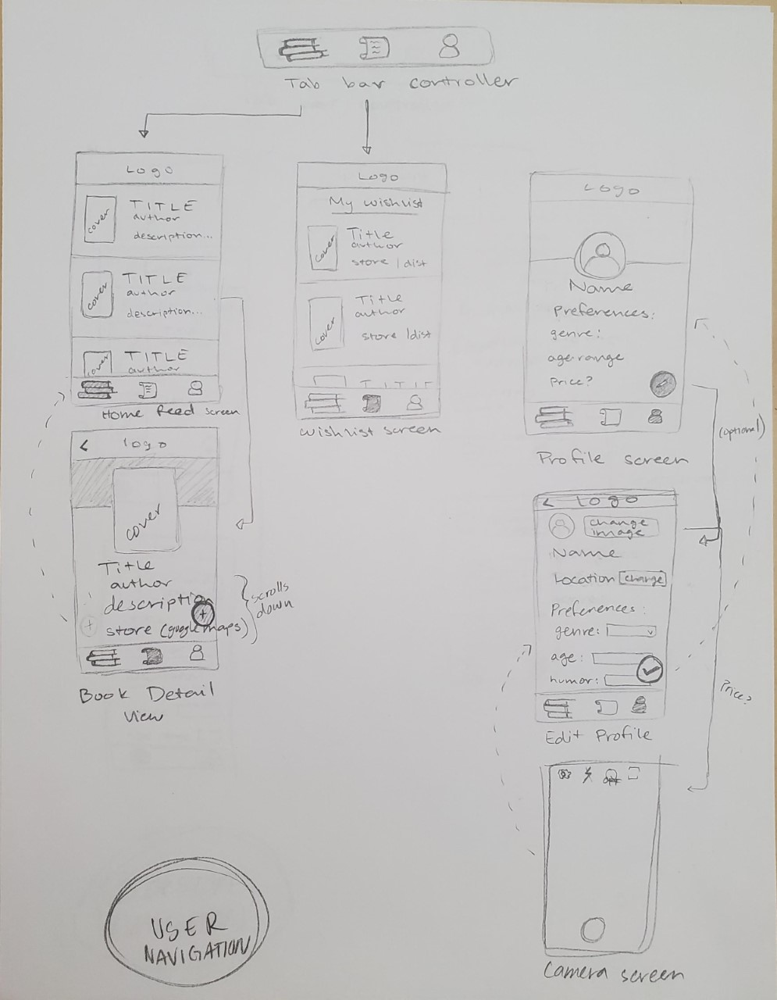
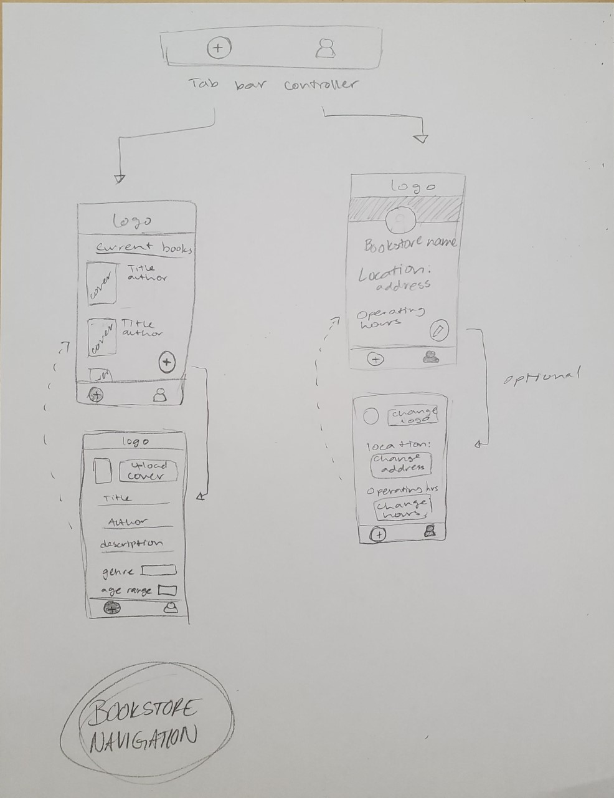

# Local Ink app

## Table of Contents
1. [Overview](#Overview)
1. [Product Spec](#Product-Spec)
1. [Wireframes](#Wireframes)
2. [Schema](#Schema)

## Overview
### Description
Local Ink is an Android app that aims to connect members of the community to independent, local booksellers by recommending books to users based on a profile. The independent booksellers and small bookstores add details for their books that are used to match books with readers' preferences. The books are recommended based on the user's profile and availability at local bookstores. Users can then add these books to a wishlist to buy later or send the list to friends or family as gift ideas. 

### App Evaluation
[Evaluation of your app across the following attributes]
- **Category:** Books/shopping
- **Mobile:** Mobile makes the app easier to use more often for short amounts of time. The user could open the app on their commute home, for instance. In addition, when the user wants to go buy books, they can use the maps feature to navigate to the bookstore. The app's ability to know the user's location in real-time no matter where they go is also helpful for the navigation.
- **Story:** Buying from independent, local booksellers supports the user's community and local economy, and with so many people staying at home right now, some small booksellers are struggling.
- **Market:** Adults and young adults who enjoy reading or want to read more while stuck at home. It provides value for those who want to read but don't know what to read. In addition, independent bookstores would use this app often. 
- **Habit:** The home screen for users is an infinitely scrolling list of books that match the user's profile starting with the best match. In addition, the user could go back and change their profile to search for gifts for a family member or friend.
- **Scope:** This is a resonably scoped project. The required features are similar to other apps in this course, especially Instagram. First, the app would allow users and bookstores to create an account and users can create a profile. Bookstores could add books that appear on the user's home screen. Then the app would incorporate logging in and out and an algorithm to match the user's profile to books based on their preferences and location. Next, I would add a way for users to add books to a wishlist and see details (including location) of the bookstore. V4 would incorporate sending wishlists to others, a bookstore's hours/curbside pick-up policy, contact info, website. Also using the Goodreads API for review and book ratings, and maybe the ability to "like" a book? In addition, since bookstores are so busy and probably already have a databse of their books, I could add a website where they could upload their database and they wouldn't have to individually upload every book

## Product Spec

### 1. User Stories (Required and Optional)

**Required Must-have Stories**

[x] The user can create an account and fill in a profile describing their preferences and location.
[x] The user can log in and out 
[x] The user can edit their preferences in their profile
[x] The user's home screen shows a list of books matching their preferences and near their location
[x] The user can add a book to their wishlist
[x] The user can view their wishlist
[x] The user can click on a book to be taken to a detail view of the book that includes the location of the store that sells the book in Google Maps
[x] The bookseller can create an account with their location
[x] The bookseller can log in and out of their account
[x] The bookseller can remove books from the database
[x] The bookseller can add books to the database
[x] The user can remove books from their wishlist

**Optional Nice-to-have Stories**

[x] The user can view the bookstores on a map that sell the books on their wishlist
[x] The user can set the distance the recommendations fragment should look for bookstores to recommend books from (i.e. setting the maximum miles away from the user to look for bookstores, or setting the number of stores away from the user that the fragment should look for books from)
[x] The bookseller can add books to by scanning the barcode of the book
[x] The user can send their wishlist to friends
[x] The user can rank their wishlist
[x] The user can search for books by title and author, and search for bookstores
[ ] For bookstores, make a website where they could upload their database and they wouldn't have to individually upload every book
[ ] The bookseller can add information to their profile including curbside pick-up, availible hours
[ ] Create unit tests to ensure high quality recommendation system

### 2. Screen Archetypes

* User registration screen
   * The user can create an account and fill in a profile describing their preferences and location.
* Bookseller registration screen
   * The bookseller can create an account with their location
* Log in screen
   * The user/bookseller can log in and out 
* Profile screen
    * The user can edit their preferences in their profile
* Recommendations/"stream" screen
    * The user's home screen shows a list of books matching their preferences and near their location
* Book detail view
    * The user can click on a book to be taken to a detail view of the book that includes the location of the store that sells the book in Google Maps
    * The user can add a book to their wishlist
* Wishlist screen
    * The user can view their wishlist
* Add book screen
    * The bookseller can add books to the database

### 3. Navigation

**Tab Navigation** (Tab to Screen)

* Home feed
* Wishlist
* View/edit profile

**Flow Navigation** (Screen to Screen)

* User registration screen
    * => Home/recommendations screen
* Bookseller registration screen
    * => Add book screen
* Log in screen
    * => Home/recommendations screen
* Profile screen
    * => Wishlist screen 
* Recommendations/"stream" screen
    * => Book detail screen
* Book detail screen
    * => None
* Wishlist screen
    * => None
* Add book screen
    * => Add book screen again

## Wireframes




### [BONUS] Digital Wireframes & Mockups
https://www.figma.com/file/6TFIQDPIiqvo3lr4rwBAvG/Bookstore-app-wireframe?node-id=0%3A1

### [BONUS] Interactive Prototype
https://www.figma.com/proto/6TFIQDPIiqvo3lr4rwBAvG/Bookstore-app-wireframe?node-id=1%3A3&scaling=scale-down

## Schema 
#### Models

Book
| Property      | Type                | Description |
| --------------| ------------------- | ----------- |
|objectId	    |String	              |unique id for the book (default field)
| title         | String              | Title of the book        |
| author        | String              | Author of the book       |
| cover         | File  (maybe URL?)  | Image (or URL to image) of the cover of the book|
| synopsis      | String              | Summary of book from publisher|
| isbn          | Number              | Standard number that is used to identify books|
| genre         | String              | Genre the book falls into|
| age range     | String              | The book's target age range for readers|
| store         | Pointer to Bookstore| The store selling this book |
| price? (optional)| Number           | Price of the book|
|createdAt	    |DateTime	          |date when book is created (default field)
|updatedAt	    |DateTime	          |date when book is last updated (default field)


User
| Property       | Type     | Description |
| -------------- | -------- | ----------- |
|objectId	     | String   |unique id for the usesr (default field)
| username       | String   | User's login username|
| name          | String   | Name of the store|
| isBookstore   | Boolean   | Whether this user is a bookstore user or not (a reader user)|
| profile       | File     | Store's profile image|
| geoLocation   | Parse GeoPoint   | User's current location in latitude/longitude|
| location      | String   | User's current location string address|
| profile (maybe)| File     | User's profile image|
| wishlist       | Array of Pointers to books| Array of all the books the user has on their wishlist |
| genrePreference| List<String>   | The user's preference of genres for recommended books|
| agePreference  | List<String>   | The user's preference for target age ranges of recommended books|
| website  | String   | The bookstore's website url (optional)|
|createdAt	     |DateTime  | date when user is created (default field)
|updatedAt	     |DateTime  | date when user is last updated (default field)


### Networking
List of network requests by screen and basic snippets for each Parse network request:
* User registration screen
    * (Create/POST) Create a new user object
 ```
// Create the ParseUser
ParseUser user = new ParseUser();
// Set properties
user.setUsername(username);
user.setPassword(password);
user.setEmail(email);
user.setGenrePreference(genrePreference);
user.setLocation(location);
user.setAgePreference(agePreference);
user.setPricePreference(genrePreference);
// Invoke signUpInBackground
user.signUpInBackground(new SignUpCallback() {
    public void done(ParseException e) {
        if (e == null) {
            Intent i = new Intent(SignUpActivity.this, LoginActivity.class);
            startActivity(i);
        } else {
            // Sign up didn't succeed.
```
* Bookseller registration screen
    * (Create/POST) Create a new bookstore object
```
Bookstore bookstore = new Bookstore();
// Set properties
bookstore.setName(name);
bookstore.setPassword(password);
bookstore.setEmail(email);
bookstore.setGenrePreference(genrePreference);
bookstore.setLocation(location);
bookstore.signUpInBackground(new SignUpCallback() {
    public void done(ParseException e) {
        if (e == null) {
            //Successful sign up, now go to home screen
        } else {
            // Sign up didn't succeed.
```
* Log in screen
    * (Read/GET) Authenticate & query log in info about user attempting to log in
    * (Read/GET) Or query persisted logged in user if someone is already logged in
```
ParseUser.logInInBackground(username, password, new LogInCallback() {
    @Override
    public void done(ParseUser user (or bookstore), ParseException e) {
        // If the request is successful, the exception will be null
        if (e != null) {
            // Issue with log in
            return;
        } else {
            // Log in successful
```
or 
```
if (ParseUser.getCurrentUser() != null) {
    // Someone is already logged in
}
```
    
* User profile screen
    * (Read/GET) Query logged in user object
```
ParseUser.getCurrentUser();
```
* Edit user profile screen
    * (Update/PUT) Update logged in user object
```
ParseUser.getCurrentUser().setGenrePreference(genrePreference);
```
* Bookstore profile screen
    * (Read/GET) Query logged in bookstore object
```
ParseUser.getCurrentUser()
```
* Recommendations/"stream" screen
    * (Read/GET) Query all books nearby that match user's preferences (algorithm)
```
// I can think of two ways of doing this: 
// Get all books and match by location & preferences(probably less efficient, more flexible)

ParseQuery<Book> query = ParseQuery.getQuery(Book.class);
// include data referred by user key
query.include(Post.KEY_BOOK);
// start an asynchronous call for books
        query.findInBackground(new FindCallback<Post>() {
            @Override
            public void done(List<Post> posts, ParseException e) {
                // check for errors
                if (e != null) {
                    // issue getting books
                }
```
Or
```

// Get the nearest x number of bookstores and match the user's preferences in those bookstores to the books in those bookstores
//(I think less flexible, more efficient)

 // specify what type of data to query - Book.class
        ParseQuery<Book> query = ParseQuery.getQuery(Bookstore.class);
        // include data referred by book key
        query.include(Book.KEY_BOOKS);

        // limit query to nearest x stores (or I might have to get all stores and find the nearest ones manually)
        query.setLimit(STORE_LIMIT);

        // order bookstores from nearest to farthest

        // start an asynchronous call for bookstores
        query.findInBackground(new FindCallback<Bookstore>() {
            @Override
            public void done(List<Bookstore> bookstores, ParseException e) {
                // check for errors
                if (e != null) {
                    //issue getting bookstores
                    return;
                }
```
* Book detail screen
    * (Read/GET) Query specific book (Might be done already in recommendations screen--unnecessary to do here?)
    * (Update/PUT) Update/add book object to wishlist in User object


* Wishlist screen
    * (Read/GET) Query logged in User and get their wishlist
```
ParseUser.getCurrentUser().getWishlist();
```
* Add book screen
    * (Create/POST) Create a new book object
```
Book book = new Book();
book.setDescription(description);
book.setCover(new ParseFile(image));
book.setAuthor(author);
book.setGenre(genre);
book.setAgeRabge(ageRange);
book.setPrice(price);
book.setUser(currentUser);
book.saveInBackground(new SaveCallback() {
    @Override
    public void done(ParseException e) {
        if (e != null) {
            // Something has gone wrong
            return;
        }
```
- [OPTIONAL: List endpoints if using existing API such as Yelp]
